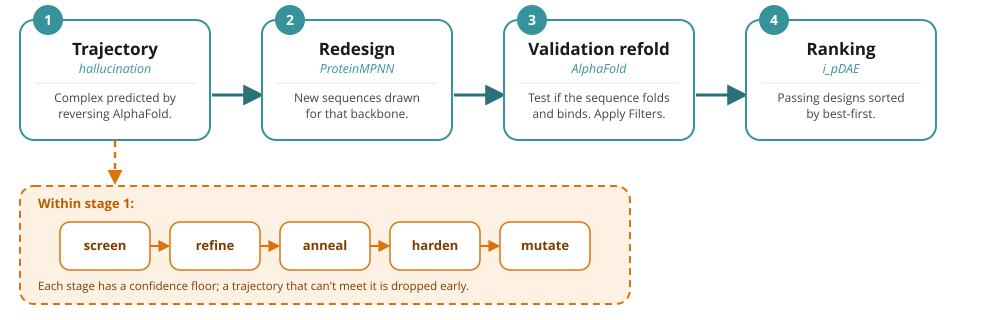

# De novo binder design with BindCraft2

BindCraft2 (BC2) designs protein binders against a target of your choosing. You give it a
structure (or sequence) and, ideally, the patch you want the binder to sit on; it hallucinates
candidate binders with AlphaFold gradients, redesigns their sequence with ProteinMPNN,
re-predicts each candidate from scratch to check it holds up, filters, and ranks what survives.

This page explains what actually happens during a run, which knobs matter for everyday designs,
how to pick a modality, and how to read the output so you can tell a promising design from a
number that only looks good. It is the BC2 companion to the original
[BindCraft wiki](https://github.com/martinpacesa/BindCraft/wiki/De-novo-binder-design-with-BindCraft); <!-- TODO: move this in to the documentation -->
the biology intuition carries over, but the settings, modalities and outputs below are BC2's.

```{important}
**One-line mental model:** a campaign keeps *trying* trajectories until it *accepts* enough
designs. A trajectory is one hallucinated binder; a design is an accepted, re-predicted,
filter-passing sequence. You ask for N final designs and a trajectory budget; it runs until it
has N or runs out of budget.
```

---

## Table of Contents

1. [How a campaign runs](#1-how-a-campaign-runs)
2. [Setting up a design](#2-setting-up-a-design)
3. [Choosing a modality](#3-choosing-a-modality)
4. [Helpful properties and objectives](#4-helpful-properties-and-objectives)
5. [Desperation and autotuning (what runs on its own)](#5-desperation-and-autotuning-what-runs-on-its-own)
6. [Reading the outputs](#6-reading-the-outputs)
7. [What to look out for (common pitfalls)](#7-what-to-look-out-for-common-pitfalls)
8. [A sensible first campaign](#8-a-sensible-first-campaign)

---

## 1. How a campaign runs



Every accepted design has been through four stages. Understanding them tells you what each output
folder means and where a design can fail.

**1. Trajectory (hallucination).** AlphaFold is run in reverse: the binder sequence is optimised by
gradient descent so the predicted complex looks like a good binder. This happens in ordered stages
— `screen → refine → anneal → harden → mutate` — that move from soft, exploratory sequences to a
hard, single amino-acid sequence. Each stage has a confidence floor; a trajectory that can't meet it
is dropped early. The structure the trajectory ends on is the *hallucinated* binder — it is **not**
yet a real prediction.

**2. Redesign (ProteinMPNN).** The hallucinated backbone is handed to ProteinMPNN, which draws
several new sequences for it (default 10 candidates). This washes out AlphaFold-specific sequence
quirks and gives sequences that a structure-prediction-free model believes fold to that backbone.

**3. Validation refold.** Each redesigned sequence is predicted **from scratch** by AlphaFold (by
default an ensemble of 2 held-out monomer models), with no gradient pushing it. This is the honest
test: does the sequence actually fold and bind on its own? The filters are applied here.

**4. Ranking.** Sequences that pass every filter are accepted, written to `3_Ranked/`, and ranked
best-first by **`i_pDAE`** (a distance-masked interface confidence, higher is better). This is the
list you actually inspect.

Design-time metrics (from stage 1) are optimistic by construction. **Trust the validation numbers
(stage 3), not the trajectory numbers.**

---

## 2. Setting up a design

A campaign is a small JSON file naming at minimum
- a target (PDB, mmCIF, FASTA, or weighted list of targets)
- a binder length range
- how many designs you want
You can run it with `bindcraft design <my_campaign.json>`. 

However, there are many more settings you can use to customize your run including: 
- `hotspots`: The residues in the target that you want contacted by the binder. 
- `binder_lengths`: length, length range, or list of possible lengths of the designed binder.
- `number_of_final_designs`: How many accepted designs to collect.
- `max_trajectories`: How many attempts are allowed, note that a difficult target may need thousands of attempts per design.
- `modality`: Specific design objective, discussed more in the [next section](#3-choosing-a-modality). 

See [Setting up a design](design-guide/02-setting-up-a-design.md) for the full settings table,
worked JSON examples, and how structured, disordered, and multi-target inputs each behave.

---

## 3. Choosing a modality

The **modality** sets the binder format and conformational objective, the optoins are: 
- `binder`
- `large_binder`
- `peptide`
- `cyclic_peptide`
- `homo_oligomer`
- `multidomain`
- `VHH`
- `scFv`
- `Fab`
- `ARP`
- `induced_fit`
- `fold_switch`

See [Choosing a modality](design-guide/03-choosing-a-modality.md) for the full modality and
application tables, the biophysical intuition behind each choice, where the antibody/ARP scaffold
frameworks come from, and the VHH extended-vs-folded-back paratope option.


When unsure, use the default `binder`, de novo miniproteins are the
most reliable format. Otherwise match the binder's shape to the epitope's shape (flat surfaces want
a larger de novo binder; grooves and pockets want an extended peptide or VHH CDR3), and expect
antibody-format scaffolds to underperform compared to de novo binders except when you specifically need that
format.

---

## 4. Helpful properties and objectives

**Properties** are optional booleans (`humanize`, `disulfide_staple`, `protease_stable`,
`termini_accessible`, `termini_together`, `mixed_topology`, and the `forced_targeting`/detargeting
targeting options) that layer a biological objective and its matching acceptance filter onto a
modality. Each is a real but narrow proxy — e.g. `humanize` screens a fixed HLA-anchor panel, not a
validated immunogenicity assay — and because every property adds both a gradient term and a filter,
stacking many of them makes acceptance rarer. Most modalities and properties combine freely; a few
combinations (e.g. a scaffold modality with `cyclic_peptide`) are contradictory and BC2 refuses them
at start-up.

See [Helpful properties and objectives](design-guide/04-properties-and-objectives.md) for what each
property actually does (and doesn't tell you), the `initial_guess`/`bigbang` initialisation options,
and the full incompatibility table.

---

## 5. Desperation and autotuning (what runs on its own)

BC2 adapts a stalled campaign automatically. The **autotuner** (on by default) makes small, harmless
adjustments to stage lengths every ten trajectories. The **desperation ladder** (also on by default)
kicks in only if a campaign accepts nothing for `desperation_trajectories` (default 750) attempts,
then progressively trades away difficulty — `initial_guess`, relaxed `target_flexibility`, held-out
`multimer` validation, more recycles — one rung every further 50 trajectories until something is
accepted. Every rung raises the expected false-positive rate, so a design's `autotuned` column tells
you how much to discount it.

See [Desperation and autotuning](design-guide/05-desperation-and-autotuning.md) for the full ladder,
the `benchmark` reproducible profile, and when `bigbang` initialisation is worth turning on.

---

## 6. Reading the outputs

The campaign output folder has three numbered stage folders — `1_Trajectories/`, `2_Refolded/`, and
`3_Ranked/` — plus provenance records. **Open `3_Ranked/!_Ranked.csv` first**: it's the single,
best-first-by-`i_pDAE` record of accepted designs. If it's empty, `2_Refolded/!_Refolded.csv`'s
`failed_filters` column says why candidates were rejected. None of the confidence metrics
(`i_pDAE`, `i_pTM`, `i_pAE`, `pTM`, `pLDDT`, `Interface_Residues`, `Binder_RMSD`, …) measure
affinity — they describe a confident predicted pose, not a tight or specific binder.

See [Reading the outputs](design-guide/06-reading-the-outputs.md) for the full folder layout and the
complete metrics table with ranges, directions and default thresholds.

---

## 7. What to look out for (common pitfalls)

<details>
<summary>Prepare the target.</summary>

Strip waters/ligands you don't want, keep the biologically relevant assembly, and make sure the
epitope you name is actually solvent-exposed in that structure. BC2 designs against what you give
it, membrane and glycan context included or not.
</details>

<details>
<summary>Hotspots are optional but steer the campaign.</summary>

BC2 runs fine with none — it reads the whole surface and finds a site. Name 3–6 exposed residues
when you care *where* the binder lands (a specific functional epitope, or a large target where you
want to focus the budget); omit them to let it choose. If it binds but off-target, add
`forced_targeting`.
</details>

<details>
<summary>Even a great score isn't a binder.</summary>

Treat the ranked list as *candidates to test*, not answers. Confidence metrics rank designs against
each other; they do not predict wet-lab success.
</details>

<details>
<summary>Watch the <code>autotuned</code> column.</summary>

Designs accepted on the desperation ladder are weaker; a campaign that only produced them is
telling you the task is too hard as posed.
</details>

<details>
<summary>Zero accepted designs is information.</summary>

Read `failed_filters` in `2_Refolded/!_Refolded.csv`. If everything fails `i_pTM`/`i_pAE`, the
epitope may be undruggable or mis-chosen; if it fails `Unbound_Binder_pLDDT`, the binders bind but
don't fold on their own (try a different length or modality).
</details>

<details>
<summary>Custom antibody/ARP scaffolds need correct numbering.</summary>

The engine rejects Kabat insertion codes — use the shipped scaffolds unless you have sequentially
renumbered your own.
</details>

<details>
<summary>Multi-target and detargeting.</summary>

You can supply several targets (weighted) and mark off-targets with `"objective": "detarget"` to
design for specificity; read the `_detarget` metrics as *avoidance*, not binding.
</details>

<details>
<summary>Reproducibility.</summary>

`campaign_seed` fixes the draws within one setup but does not guarantee identical numbers across
machines/GPUs. A campaign **resumes by default** — rerun the same command against the same folder
to continue it.
</details>

---

## 8. A sensible first campaign

1. Prepare and inspect your target; decide whether to name hotspots (optional — name them to focus a
   specific epitope, or leave them off to let BC2 find a site).
2. Start with `"modality": "binder"` at its default lengths, a handful of designs and a few hundred
   trajectories as a smoke test.
3. Open `3_Ranked/!_Ranked.csv`. If it's empty, read `failed_filters` and adjust the epitope, length
   or modality — not the loss weights.
4. Once designs appear at your requested settings (not on desperation rungs), scale
   `number_of_final_designs` and `max_trajectories` up for the real run.
5. Rank/inspect the top designs, check the poses by eye, and order a diverse set — top `i_pDAE` is a
   starting point, not a guarantee.

For the exhaustive list of every setting and its default, see
[`reference.md`](reference.md); for every output file and measurement, see
[`outputs.md`](outputs.md).
